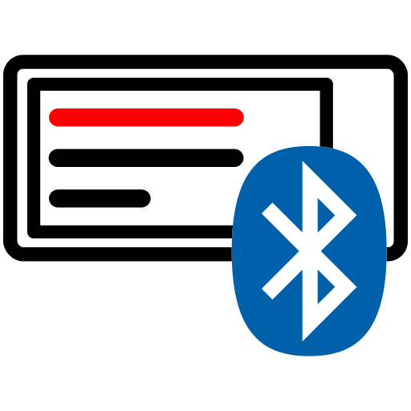

# BLE ePaper for Home Assistant

This is a custom integration for Home Assistant that supports BLE (Bluetooth Low Energy) ePaper
ESL (Electronic Shelf Label) displays.

Currently, this integration supports BLE ePaper displays from Picksmart, also known as Gicisky.

## Installation

HACS installation is upcoming, once this integration leaves beta state.
